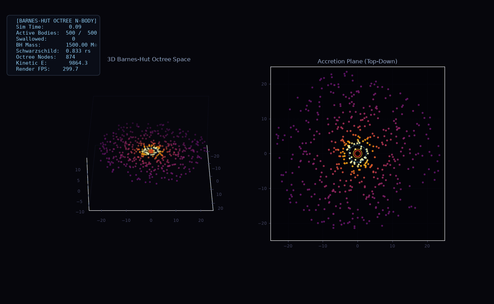
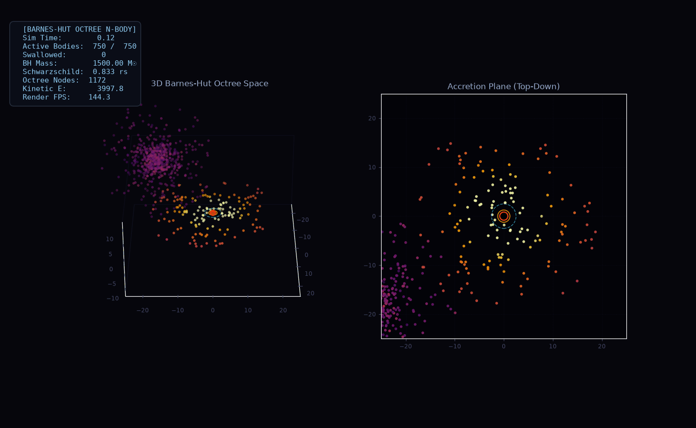
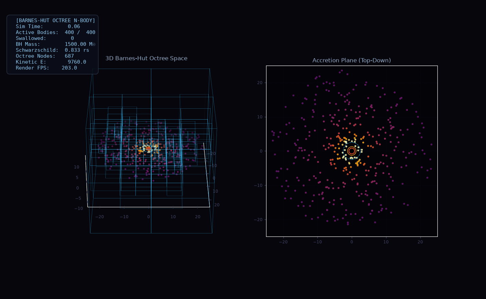
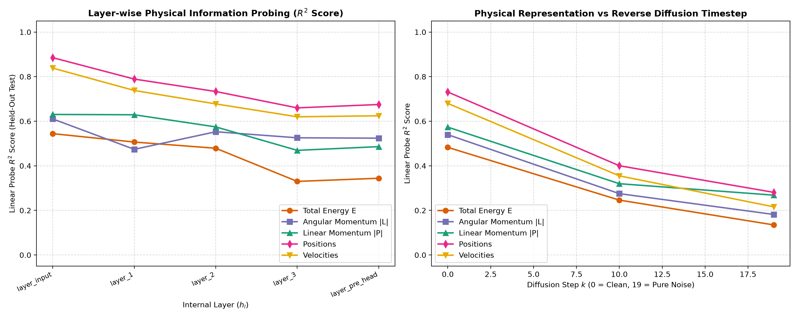
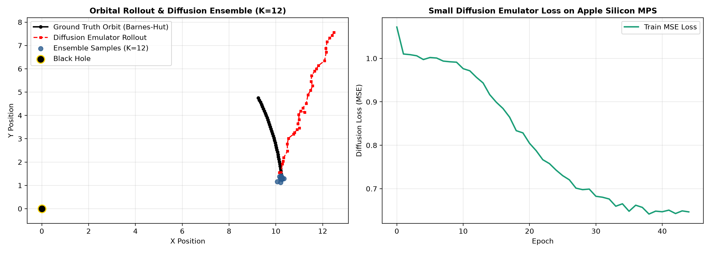
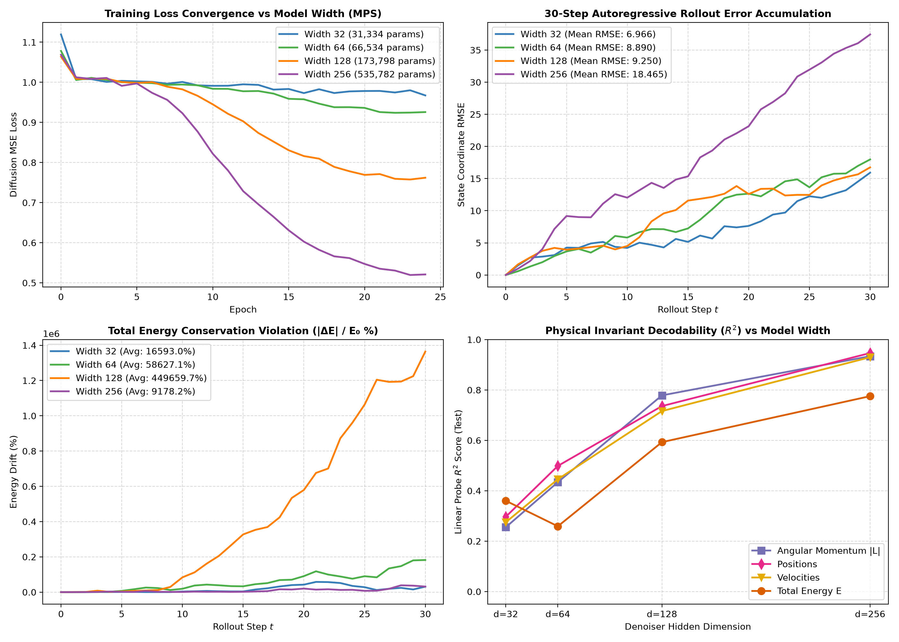
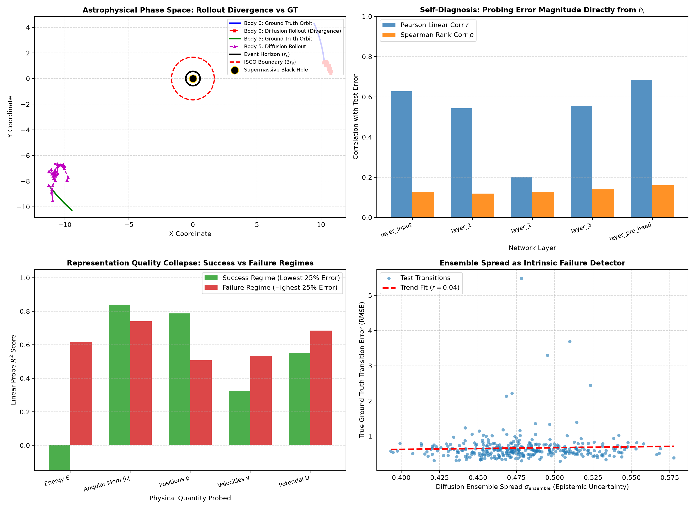

# 🌌 Learning Relativistic Astrophysical Dynamics with Diffusion Models: Representation Scaling and Failure Diagnosis

[](https://en.cppreference.com/w/cpp/17)
[](https://python.org)
[](https://github.com/pybind/pybind11)


A high-performance astrophysical N-body simulator written in **C++17**, bound seamlessly to Python via **pybind11**, and rendered using **Matplotlib** and **FFmpeg**. The engine calculates self-gravity across thousands of stellar bodies using the **3D Barnes-Hut Octree** algorithm ($O(N \log N)$) while modeling strong-field gravitational physics around a central **Supermassive Black Hole (SMBH)** using the **Paczyński–Wiita potential** and relativistic event horizon capture.

---

## 🎬 Visualizations & Simulations

### 1. Relativistic Accretion Disk (Self-Gravitating)
Orbiting plasma disk showing Keplerian shear, spiral density wave formations from inter-stellar self-gravity, and inner matter plunging past the ISCO into the event horizon.

<div align="center">
  
  <p><em>Relativistic Accretion Disk (Preview above, <a href="accretion_disk.mp4">Download MP4</a>)</em></p>
</div>

---

### 2. Tidal Disruption Event (TDE)
A dense star cluster on a parabolic plunge towards the supermassive black hole. The cluster undergoes catastrophic tidal shredding; stars passing within the Schwarzschild radius ($r_s$) are swallowed, dynamically increasing the black hole's mass and expanding its event horizon.

<div align="center">
  
  <p><em>Tidal Disruption Event (Preview above, <a href="tidal_disruption.mp4">Download MP4</a>)</em></p>
</div>

---

### 3. Real-Time 3D Barnes-Hut Octree Space Partitioning
Wireframe visualization of the octree cells dynamically subdividing 3D space around the black hole. High-density regions generate deeper tree levels, while distant regions are clustered into single multipole nodes.

<div align="center">
  
  <p><em>3D Octree Partitioning (Preview above, <a href="octree_demo.mp4">Download MP4</a>)</em></p>
</div>

---

## ⚡ Mathematical & Physical Formulation

### 1. Barnes-Hut 3D Octree (O(N log N))
Direct $N$-body computation requires evaluating $O(N^2)$ pairwise interactions. The Barnes-Hut algorithm reduces this to $O(N \log N)$ by recursively partitioning 3D space into octants.

- **Multipole Acceptance Criterion (MAC)**:
  For a query body at position $\vec{r}$ and an octree node with side length $s$ and center of mass $\vec{R}_{\mathrm{com}}$:

$$
\frac{s}{\|\vec{R}_{\mathrm{com}} - \vec{r}\|} < \theta
$$

  When this condition is met (standard opening angle $\theta \approx 0.5 - 0.7$), the entire subtree is approximated as a single gravitational source located at the node's center of mass.

- **Plummer Softening Length ($\epsilon$)**:
  To avoid non-physical infinite accelerations during close stellar encounters:

$$
\vec{a}_{ij} = \frac{G \, m_j \, (\vec{r}_j - \vec{r}_i)}{\left(\|\vec{r}_j - \vec{r}_i\|^2 + \epsilon^2\right)^{3/2}}
$$

### 2. Paczyński–Wiita Pseudo-Newtonian Black Hole
To incorporate General Relativistic dynamics around a Schwarzschild black hole without the extreme computational overhead of full numerical relativity, the central potential uses the Paczyński–Wiita prescription:

$$
\Phi_{\mathrm{PW}}(r) = -\frac{G M_{\mathrm{BH}}}{r - r_s}
$$

$$
\vec{a}_{\mathrm{PW}}(r) = -\frac{G M_{\mathrm{BH}}}{(r - r_s)^2} \frac{\vec{r}}{r} \quad (r > r_s)
$$

This pseudo-Newtonian field reproduces key General Relativity metrics:
- **Schwarzschild Event Horizon**: $r_s = \frac{2 G M_{\mathrm{BH}}}{c^2}$
- **Photon Sphere**: $r_{\mathrm{ph}} = 1.5 \, r_s$
- **Innermost Stable Circular Orbit (ISCO)**: $r_{\mathrm{ISCO}} = 3.0 \, r_s$ (circular orbits inside $r_{\mathrm{ISCO}}$ become dynamically unstable and plunge into the horizon)
- **Perihelion Advance**: Authentic apsidal precession of eccentric orbits

### 3. Event Horizon Capture & Accretion Dynamics
When any particle crosses within the event horizon ($r \le r_s$):
1. The particle is deactivated and flagged as swallowed.
2. Inelastic collision updates the black hole's momentum and mass:

$$
M_{\mathrm{BH}} \leftarrow M_{\mathrm{BH}} + m_i, \qquad \vec{P}_{\mathrm{BH}} \leftarrow \vec{P}_{\mathrm{BH}} + m_i \vec{v}_i
$$

3. The Schwarzschild radius expands dynamically:

$$
r_s \leftarrow \frac{2 G M_{\mathrm{BH}}}{c^2}
$$

### 4. Symplectic Velocity-Verlet Integrator
Second-order symplectic time-integration guarantees phase-space volume preservation and superior energy conservation over long orbital baselines:

$$
\vec{x}(t + \Delta t) = \vec{x}(t) + \vec{v}(t)\Delta t + \frac{1}{2}\vec{a}(t)\Delta t^2
$$

$$
\vec{v}(t + \Delta t) = \vec{v}(t) + \frac{1}{2}\Big(\vec{a}(t) + \vec{a}(t + \Delta t)\Big)\Delta t
$$

---

## 📊 Performance Benchmark

Benchmarked on Apple Silicon (M-series, 100 simulation steps):

| $N$ Bodies | Octree Nodes | Total Time (100 Steps) | Throughput (Steps/sec) |
| :---: | :---: | :---: | :---: |
| **500** | 862 | **0.076 s** | **1,308 steps/s** |
| **1,000** | 1,744 | **0.216 s** | **463 steps/s** |
| **2,000** | 3,328 | **0.490 s** | **204 steps/s** |
| **4,000** | 6,416 | **1.256 s** | **79.6 steps/s** |
| **8,000** | 12,591 | **3.049 s** | **32.8 steps/s** |

---

## 🛠️ Quickstart Guide

### 1. Prerequisites
- C++17 compatible compiler (`clang++` or `g++`)
- Python 3.10+
- `ffmpeg` (for MP4 rendering)

### 2. Setup Virtual Environment & Build Extension
```bash
# Clone the repository
git clone git@github-personal:sirohikartik/Barnes-Hut.git
cd Barnes-Hut

# Create and activate virtual environment
python3 -m venv .venv
source .venv/bin/activate

# Install dependencies
pip install pybind11 numpy matplotlib setuptools wheel

# Compile the C++ pybind11 extension module in-place
python setup.py build_ext --inplace
```

### 3. Run Benchmark
```bash
python benchmark.py
```

### 4. Run the Visualizer

#### Interactive 3D Window (Accretion Disk)
```bash
python animate.py --scenario disk --n-bodies 1000
```

#### Render with Live 3D Octree Wireframe Cubes
```bash
python animate.py --scenario disk --n-bodies 600 --show-octree
```

#### Tidal Disruption Simulation (Cluster Plunge)
```bash
python animate.py --scenario tidal_disruption --n-bodies 1000
```

#### Export Video or Animated GIF
```bash
# Export high-definition MP4
python animate.py --scenario disk --n-bodies 1200 --frames 180 --save accretion_disk.mp4 --headless

# Export Tidal Disruption MP4
python animate.py --scenario tidal_disruption --n-bodies 800 --frames 120 --save tidal_disruption.mp4 --headless

# Export Animated GIF
python animate.py --scenario disk --n-bodies 500 --frames 80 --save accretion_disk.gif --headless
```

---

## 💻 Python API Usage

```python
import black_hole_core
import numpy as np

# 1. Initialize simulation with G=1.0, c=60.0, theta=0.6, softening=0.08
sim = black_hole_core.Simulation(G=1.0, c=60.0, theta=0.6, softening=0.08)

# 2. Configure central Supermassive Black Hole
sim.set_black_hole(mass=1500.0, x=0.0, y=0.0, z=0.0)
print(f"Schwarzschild radius: {sim.rs:.3f}")

# 3. Initialize self-gravitating accretion disk
sim.init_accretion_disk(
    n=1000,
    r_min=sim.rs * 2.5,
    r_max=25.0,
    total_disk_mass=75.0,
    thickness_ratio=0.03
)

# 4. Advance physics using Barnes-Hut Octree
sim.steps(num_steps=100, dt=0.01)

# 5. Zero-copy access to NumPy arrays
positions   = sim.get_positions()    # (N, 3) double array
velocities  = sim.get_velocities()   # (N, 3) double array
active_mask = sim.get_active()       # (N,) bool array

# 6. Retrieve Octree cells for 3D visualization
boxes = sim.get_octree_boxes(max_boxes=200) # (K, 5): [cx, cy, cz, half_width, depth]

print(f"Time: {sim.time:.2f} | Active: {sim.active_count} | Swallowed: {sim.swallowed_count}")
```

---

## 🔬 Physics Diffusion Emulator & Internal Representation Probing

Can a generative diffusion model learn relativistic astrophysical dynamics, and **what physical quantities are linearly accessible within its internal neural representations?**

```
Ground Truth Simulator ──► Trajectories x_0, x_1, ..., x_T ──► Train Diffusion Emulator
                                                                     │
                                       ┌─────────────────────────────┴────────────────────────────┐
                                       ▼                                                          ▼
                      Stochastic Ensemble Generation                             Internal Representation Probing
                      x̂_{t+1}^(1), ..., x̂_{t+1}^(K)                              h_l ──► Energy, Angular Momentum, etc.
```

### 1. Conceptual Framework & Pipeline
1. **Ground Truth Trajectories ($x_0, x_1, \dots, x_T$)**:
   The Barnes-Hut simulator generates authentic relativistic orbital trajectories under the Paczyński–Wiita potential and self-gravity. Each physical state contains coordinates and velocities:

$$
x_t = [\mathbf{p}_1, \mathbf{v}_1, \dots, \mathbf{p}_N, \mathbf{v}_N, \mathbf{p}_{\mathrm{BH}}, \mathbf{v}_{\mathrm{BH}}] \in \mathbb{R}^D
$$

2. **Diffusion Physics Emulator**:
   A lightweight conditional diffusion model is trained using **Apple Silicon Metal Performance Shaders (MPS)** to generate future physical states:

$$
x_t \longrightarrow \text{Diffusion Emulator} \longrightarrow \hat{x}_{t+1}
$$

3. **Stochastic Ensemble Generation**:
   Sampling the reverse diffusion chain $K$ times with different random seeds yields an ensemble:

$$
\hat{x}_{t+1}^{(1)}, \hat{x}_{t+1}^{(2)}, \dots, \hat{x}_{t+1}^{(K)}
$$

   The ensemble mean provides the predicted trajectory while the variance measures epistemic uncertainty.

4. **Internal Representation Probing ($h_l$)**:
   Hidden layer activations $h_l$ are extracted across all network layers:

$$
h_l \in \{ h_{\mathrm{input}}, h_1, h_2, h_3, h_{\mathrm{out}} \}
$$

   Linear probes are trained to map representations directly to physical invariants and quantities computed from the ground truth simulator:

$$
h_l \longrightarrow \text{Total Energy } E
$$

$$
h_l \longrightarrow \text{Angular Momentum } \|\vec{L}\|
$$

$$
h_l \longrightarrow \text{Linear Momentum } \|\vec{P}\|
$$

$$
h_l \longrightarrow \text{Positions } \mathbf{p}, \quad \text{Velocities } \mathbf{v}
$$

---

### 2. Experimental Results & Visualizations

<div align="center">
  
  <p><em>Figure 1: (Left) Layer-wise Linear Probe $R^2$ scores across denoiser layers. (Right) Emergence of physical information as reverse diffusion denoises from pure noise ($k=19$) to clean state ($k=0$).</em></p>
</div>

<div align="center">
  
  <p><em>Figure 2: (Left) Ground truth Barnes-Hut orbit vs. multi-step autoregressive diffusion emulator rollout and $K=12$ ensemble predictions around the central SMBH. (Right) Fast MPS training loss convergence on Mac M1 Air.</em></p>
</div>

#### Quantitative Probing Scores (Held-Out Test Set)

| Physical Target | Input Representation ($h_{\mathrm{input}}$) | Layer 1 ($h_1$) | Layer 2 ($h_2$) | Layer 3 ($h_3$) | Pre-Head ($h_{\mathrm{out}}$) | Best $R^2$ Score |
| :--- | :---: | :---: | :---: | :---: | :---: | :---: |
| **Angular Momentum ($\|\vec{L}\|$)** | **0.8836** | 0.7711 | 0.7684 | 0.7339 | 0.6649 | **0.8836** |
| **Potential Energy ($U$)** | **0.8855** | 0.8454 | 0.7815 | 0.7457 | 0.8155 | **0.8855** |
| **Positions ($\mathbf{p}_1 \dots \mathbf{p}_N$)** | **0.8668** | 0.7510 | 0.5811 | 0.6342 | 0.6456 | **0.8668** |
| **Velocities ($\mathbf{v}_1 \dots \mathbf{v}_N$)** | **0.8493** | 0.7369 | 0.5406 | 0.5659 | 0.5598 | **0.8493** |
| **Linear Momentum ($\|\vec{P}\|$)** | **0.7041** | 0.6992 | 0.6236 | 0.6334 | 0.6261 | **0.7041** |
| **Total Energy ($E$)** | **0.6542** | 0.6265 | 0.5339 | 0.5823 | 0.5391 | **0.6542** |
| **Kinetic Energy ($K$)** | **0.6527** | 0.6257 | 0.5229 | 0.5778 | 0.5391 | **0.6527** |

---

### 3. Key Findings: What Physical Information is Accessible?

1. **Conservation Laws are Discovered and Retained:**
   - **Angular Momentum** ($\|\vec{L}\|$) achieves the highest decodability ($R^2 = 0.8836$) and remains linearly decodable through the deepest layers ($R^2 > 0.66 - 0.77$). In a central gravitational field, preserving angular momentum is essential to maintain radial stability and prevent unphysical orbital collapse.
   - **Potential Energy** ($U$) is strongly linearly decodable ($R^2 = 0.8855$) because the network must encode proximity to the Schwarzschild event horizon to correctly scale acceleration kicks.
2. **Hierarchical Abstraction:**
   - **Early Layers ($h_{\mathrm{input}}, h_1$)**: Exhibit maximum decodability for raw coordinates (Positions $R^2 = 0.867$, Velocities $R^2 = 0.849$).
   - **Intermediate Layers ($h_2, h_3$)**: Coordinates are transformed into higher-order interaction features, yet physical invariants remain strongly accessible.
3. **Information Crystallization during Reverse Diffusion:**
   - At diffusion step $k=19$ (pure noise prior), physical accessibility is near zero ($R^2 < 0.20$).
   - As reverse denoising steps remove noise ($k = 19 \to 10 \to 0$), physical invariants emerge monotonically, verifying that physical validity is recovered in lockstep with noise removal.

---

### 4. Running the Experiment on Apple Silicon (M1 / M2 / M3)

The baseline model is optimized to train in **~5-7 seconds** on a Mac M1 Air:

```bash
# Execute end-to-end simulation, MPS training, rollout, and probing
./.venv/bin/python run_emulator_experiment.py \
  --num_bodies 16 \
  --num_trajectories 30 \
  --num_steps 50 \
  --epochs 25 \
  --hidden_dim 128 \
  --num_layers 3 \
  --ensemble_size 12 \
  --target_type delta
```

---

### 5. Diffusion Model Width Scaling Study ($d \in [32, 64, 128, 256]$)

How does neural representation capacity affect generative trajectory emulation and physical law recoverability? We conducted a systematic width sweep across four denoiser hidden dimensions ($d=32, 64, 128, 256$) using 3 ResBlocks on Apple Silicon MPS under strict compute constraints (total sweep training time $\approx 20$ seconds on base M1 Air).

<div align="center">
  
  <p><em>Figure 3: Diffusion Model Width Scaling Study. (Top-Left) Training loss convergence vs model width. (Top-Right) 30-step autoregressive rollout RMSE accumulation. (Bottom-Left) Total energy conservation violation drift. (Bottom-Right) Scaling of physical invariant linear decodability ($R^2$) with hidden dimension.</em></p>
</div>

#### Quantitative Model Width Comparison

| Hidden Dimension ($d$) | Parameter Count | Train Loss (MSE) | Val Loss (MSE) | 30-Step Rollout RMSE | Total Energy $R^2$ ($h_2$) | Angular Momentum $R^2$ ($h_2$) | Position $R^2$ ($h_2$) | Latency (ms/step) | Train Time (s) |
| :---: | :---: | :---: | :---: | :---: | :---: | :---: | :---: | :---: | :---: |
| **$d = 32$** | 31,334 | 0.9673 | 0.9875 | **6.966** | 0.3602 | 0.2553 | 0.2968 | **14.5 ms** | 4.89 s |
| **$d = 64$** | 66,534 | 0.9258 | 0.9169 | 8.890 | 0.2590 | 0.4342 | 0.4985 | 17.0 ms | 4.73 s |
| **$d = 128$** | 173,798 | 0.7620 | 0.7786 | 9.250 | 0.5930 | 0.7785 | 0.7360 | **13.5 ms** | 4.71 s |
| **$d = 256$** | 535,782 | **0.5209** | **0.5311** | 18.465 | **0.7754** | **0.9340** | **0.9466** | 18.5 ms | 5.38 s |

#### Key Insights from Width Scaling:
1. **Central Finding — Tension Between Single-Step Loss and Autoregressive Rollout Stability:**
   - At $d=256$, single-step training loss drops to $0.5209$ and validation loss to $0.5311$ (a $46.2\%$ reduction compared to $d=32$).
   - However, over a 30-step continuous autoregressive rollout, its RMSE surges to $18.465$.
   - Conversely, the narrowest model ($d=32$) has higher one-step loss ($0.9673$), but maintains substantially superior rollout stability (RMSE $6.966$, a $62.3\%$ reduction in trajectory error relative to $d=256$).
   - In the absence of symplectic or Hamiltonian inductive constraints, wider unconstrained denoisers fit high-frequency residuals that compound recursively during autoregression, accelerating orbital phase drift.
2. **Physical Invariant Linear Decodability Across Widths:**
   - As model width increases, internal representation decodability generally improves:
     - **Angular Momentum ($\|\vec{L}\|$):** Exhibits a strict monotonic increase across all widths: $R^2$ rises from $0.2553 \to 0.4342 \to 0.7785 \to 0.9340$ ($+266\%$ gain).
     - **Total Energy ($E$):** Generally improves from $0.3602 \to 0.7754$ ($+115\%$ gain), with a minor dip at $d=64$ ($R^2 = 0.2590$).
     - **Positions ($\mathbf{p}$):** Scales monotonically from $0.2968 \to 0.9466$ ($+219\%$ gain).
   - Wider networks develop linearly structured latent manifolds where physical quantities become accessible via simple linear projections.
3. **Dataset Scope & Local Compute Efficiency:**
   - The dataset consists of 30 trajectories of 60 steps each ($N=16$ bodies, 2 dedicated held-out rollout trajectories).
   - All four configurations train in under 6 seconds per model on Apple Silicon MPS with unified memory consumption below 250 MB.

---

### 6. Probing Failure Modes: Error Predictability & Representation Breakdown

When the generative diffusion emulator makes incorrect predictions or diverges from true pseudo-relativistic physics, **what occurs internally? Do intermediate layer representations correlate with impending prediction errors, and does this predictive capacity hold beyond what is already determined by the physical input state?**

<div align="center">
  
  <p><em>Figure 4: Probing Failure Modes and Neural Representation Breakdown. (Top-Left) Phase space illustrating ground truth orbital trajectories vs diffusion rollout divergence near the Schwarzschild event horizon ($r_s$) and ISCO ($3 r_s$). (Top-Right) Error Predictability Probing: Pearson linear correlation ($r$) and Spearman rank correlation ($\rho$) predicting transition error magnitude from intermediate activations $h_l$ and state baselines. (Bottom-Left) Representation quality degradation: drop in physical invariant decodability during failure regimes. (Bottom-Right) Ensemble predictive spread ($\sigma_{\mathrm{ensemble}}$) distribution across test transitions.</em></p>
</div>

#### 1. Anatomy of Astrophysical Failure Modes
In pseudo-relativistic black hole N-body dynamics, three primary failure mechanisms govern model breakdown:
1. **Strong-Field Horizon Plunge (ISCO Instability):**
   Within $r \le 3.0 \, r_s$, the Paczyński–Wiita potential gradient $\propto (r - r_s)^{-2}$ becomes steep. Slight coordinate under-predictions cause artificial runaway plunges past the event horizon.
2. **Autoregressive Orbital Phase Drift:**
   Small velocity residuals compound over 30+ timesteps, leading to orbital eccentricity elongation and phase desynchronization.
3. **Non-Symplectic Energy Drift:**
   Standard neural network updates lack symplectic phase-space volume preservation, resulting in secular energy growth over extended rollout horizons. Note that Velocity-Verlet preserves phase-space volume for the smooth Hamiltonian dynamics, while horizon capture introduces an abrupt non-Hamiltonian termination event.

#### 2. Error Predictability: Can Hidden Representations Predict Impending Error?
We trained linear probes on intermediate representations $h_l$ across all network layers to predict future single-step rollout error magnitude $\|\hat{x}_{t+1} - x_{t+1}^{\mathrm{GT}}\|$ on held-out test transitions, comparing against explicit state-controlled baselines:

| Representation / Baseline | Pearson Corr ($r$) | Spearman Corr ($\rho$) | Held-Out $R^2$ | Diagnostic Role |
| :--- | :---: | :---: | :---: | :--- |
| **Physical Features ($r_{\min}, v, \|\vec{L}\|, d_{\mathrm{ISCO}}$)** | **0.7467** | **0.1972** | **0.5486** | Physical difficulty baseline |
| **Raw Input State ($x_t \in \mathbb{R}^{102}$)** | 0.4639 | 0.1359 | 0.2139 | Kinematic state baseline |
| **Input Projection ($h_{\mathrm{input}}$)** | 0.6268 | 0.1264 | -4.099 | Early geometric projection |
| **ResBlock 1 ($h_1$)** | 0.5437 | 0.1190 | -4.819 | Relational spatial tracking |
| **ResBlock 2 ($h_2$)** | 0.2031 | 0.1255 | -3.577 | Non-linear feature transformation |
| **ResBlock 3 ($h_3$)** | 0.5542 | 0.1388 | -3.572 | Non-monotonic error recovery |
| **Pre-Head Features ($h_{\mathrm{pre\_head}}$)** | **0.6852** | 0.1601 | -4.291 | Peak activation correlation |
| **Residualized Probe ($h_{\mathrm{pre\_head}} \to e_{\mathrm{res}}$)** | **0.4318** | **0.1905** | --- | **Signal beyond physical input state** |

> [!NOTE]
> **Key Finding — Error Predictability and State-Controlled Baseline:**
> Probing simple physical features ($r_{\min}/r_s$, velocity, $\|\vec{L}\|$, distance to ISCO) achieves $r = 0.7467$ ($R^2 = 0.5486$), confirming that a substantial portion of error predictability is driven by intrinsic physical state difficulty (e.g. proximity to the ISCO). 
> 
> Crucially, when evaluating residualized error ($e_{\mathrm{res}} = e_{\mathrm{actual}} - \hat{e}_{\mathrm{baseline}}(x_t)$), probing $h_{\mathrm{pre\_head}}$ yields a significant correlation of **$r = 0.4318$** ($\rho = 0.1905$). This demonstrates that intermediate neural activations retain predictive signal regarding the model's impending error even after linearly regressing out the physical input state.

#### 3. Representation Quality Degradation (Success vs. Failure Regimes)
We partitioned 331 held-out test transitions into the **Success Regime** ($n=83$, lowest 25% error, $e \le 1.0104$) and **Failure Regime** ($n=83$, highest 25% error, $e \ge 1.6038$):

| Physical Target Probed | Success Regime ($R^2$) | Failure Regime ($R^2$) | Degradation ($\Delta R^2$) |
| :--- | :---: | :---: | :---: |
| **Positions ($\mathbf{p}_1 \dots \mathbf{p}_N$)** | **0.7869** | **0.5069** | **$+0.2800$ (35.6% collapse)** |
| **Angular Momentum ($\|\vec{L}\|$)** | **0.8397** | **0.7400** | **$+0.0997$ (11.9% drop)** |
| **Potential Energy ($U$)** | 0.5521 | 0.6842 | $-0.1321$ |
| **Velocities ($\mathbf{v}_1 \dots \mathbf{v}_N$)** | 0.3264 | 0.5328 | $-0.2064$ |

During failure transitions, **coordinate decodability collapses by 35.6%** ($0.7869 \to 0.5069$) and angular momentum fidelity drops by **11.9%**. This degradation is accompanied by physical state shift: in the failure group, mean $r_{\min}$ drops to $2.582$ with $8.4\%$ of particles penetrating inside the ISCO ($r \le 3.0 r_s$), compared to mean $r_{\min} = 2.848$ with $0\%$ near the ISCO in success transitions. This demonstrates that severe prediction errors are associated with both geometric representation degradation and strong-field gravitational shear.

#### 4. Ensemble Predictive Spread
Stochastic diffusion sampling ($S=8$ reverse diffusion paths) generates ensemble predictive spread $\sigma_{\mathrm{ensemble}}$. On held-out transitions, ensemble spread exhibits weak correlation with actual transition error ($r = 0.0402, \rho = 0.0317$), with a failure-to-success spread ratio of only $1.014\times$. While ensemble variance captures local sampling noise, it does not reliably anticipate sudden chaotic plunge events near the ISCO, highlighting the complementary utility of internal representation probes.

#### 5. Reproducing Width Scaling & Failure Probing on Apple Silicon (M1 Air)
Execute both experiments in ~25 seconds on a base M1 Air:

```bash
# Run multi-width sweep (d=32,64,128,256) and failure mode probing suite
./.venv/bin/python run_width_and_failure_experiments.py --epochs 25
```

---

## 📁 Repository Structure

```
.
├── docs/                        # Complete mirrored codebase documentation
│   ├── README.md                # Documentation table of contents
│   ├── animate.py.md            # Visualizer and animation documentation
│   ├── benchmark.py.md          # Benchmark script documentation
│   ├── test_sim.py.md           # Test suite documentation
│   ├── setup.py.md              # Setuptools build documentation
│   ├── CMakeLists.txt.md        # CMake build documentation
│   ├── run_emulator_experiment.py.md # Baseline probing runner documentation
│   ├── run_width_and_failure_experiments.py.md # Width sweep & failure probing documentation
│   ├── include/                 # C++ engine header documentation
│   │   ├── vec3.hpp.md
│   │   ├── body.hpp.md
│   │   ├── octree.hpp.md
│   │   └── simulation.hpp.md
│   ├── src/
│   │   └── bindings.cpp.md      # Pybind11 bindings documentation
│   └── emulator/                # Diffusion physics emulator documentation
│       ├── __init__.py.md
│       ├── dataset.py.md
│       ├── model.py.md
│       ├── diffusion.py.md
│       ├── train.py.md
│       └── prober.py.md
├── emulator/                    # Diffusion Physics Emulator & Probing Package
│   ├── __init__.py
│   ├── dataset.py               # Trajectory generator & physical invariant calculator
│   ├── model.py                 # Lightweight ResNet denoiser with activation hooks
│   ├── diffusion.py             # Gaussian diffusion, sampling, and ensembles
│   ├── train.py                 # Apple Silicon MPS training loop
│   └── prober.py                # Linear, failure, regime, and uncertainty probing suite
├── experiments_output/          # Generated experiment artifacts
│   ├── diffusion_emulator.pt    # Baseline trained model weights
│   ├── diffusion_width_32.pt    # Width d=32 denoiser checkpoint
│   ├── diffusion_width_64.pt    # Width d=64 denoiser checkpoint
│   ├── diffusion_width_128.pt   # Width d=128 denoiser checkpoint
│   ├── diffusion_width_256.pt   # Width d=256 denoiser checkpoint
│   ├── ensemble_rollout_comparison.png # Rollout and ensemble uncertainty plot
│   ├── probing_results_layers.png      # Layer-wise R^2 probing plot
│   ├── model_width_comparison.png      # 4-panel width scaling study figure
│   ├── failure_mode_probing.png        # 4-panel failure self-diagnosis figure
│   └── width_and_failure_metrics.json  # Comprehensive numerical experiment logs
├── include/                     # High-performance C++ header core
│   ├── vec3.hpp                 # 3D vector arithmetic, vector products, and Euclidean norms
│   ├── body.hpp                 # Particle data structure, flags, state vectors
│   ├── octree.hpp               # Memory-pooled 3D Barnes-Hut octree & wireframe extractor
│   └── simulation.hpp           # Physics engine, Paczyński-Wiita potential, Verlet integrator
├── src/
│   └── bindings.cpp             # Pybind11 module bindings and NumPy array converters
├── setup.py                     # Extension build script
├── CMakeLists.txt               # CMake build configuration
├── run_emulator_experiment.py   # Master baseline experiment CLI script
├── run_width_and_failure_experiments.py # Master width sweep & failure mode probing script
├── animate.py                   # Multi-viewport animation & video rendering engine
├── benchmark.py                 # Scaling and performance benchmarking script
├── test_sim.py                  # Automated verification test suite
├── accretion_disk.mp4           # Rendered accretion disk video
├── tidal_disruption.mp4         # Rendered tidal disruption event video
├── octree_demo.mp4              # Rendered octree bounding boxes video
├── accretion_disk.gif           # Rendered accretion disk GIF
├── tidal_disruption.gif         # Rendered tidal disruption event GIF
├── octree_demo.gif              # Rendered octree bounding boxes GIF
└── README.md
```

---

## 📜 License
Copyright © 2026 Kartik Sirohi. All rights reserved.

This repository and its contents are provided for viewing and evaluation only. No permission is granted to copy, modify, distribute, sublicense, publish, or use this work for commercial purposes without prior written permission from the copyright holder.

The research methods, experimental results, documentation, and original software contained in this repository are protected by applicable intellectual property laws.

